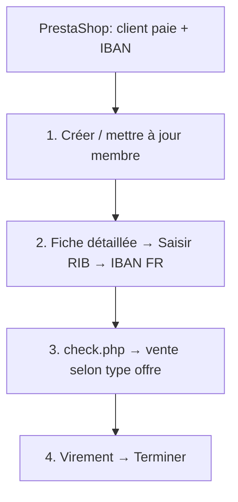

# Workflow Boxing Center — Toutes les offres (sans Caisse)

Le menu **Caisse** est bloqué (`LDC_activerModuleCaisse: false`).  
Les ventes passent par **`check.php?idj=XXX`** → **Achat Abonnement** ou **Achat Carte** → `nextgen/vente`.

---

## Flux commun (toutes offres payantes)



---

## 1. Saisir le RIB (toutes offres avec prélèvement)

| Étape | Action |
|-------|--------|
| 1 | Ouvrir `joueurs.php?idj=XXX` (**Fiche détaillée**) |
| 2 | Compléter les champs client |
| 3 | **Mettre à jour** |
| 4 | Cliquer **Saisir RIB** (bouton violet) |
| 5 | Onglet **SEPA** → coller **IBAN FR** (vérifié par BOXPLUS) |
| 6 | **Valider** |

BOXPLUS : `bot/wallet.js` → `setMemberIban()`

---

## 2. Offre DUO 29 € — `sale_type: abonnement`

| Étape | Action |
|-------|--------|
| 1 | RIB saisi (ci-dessus) |
| 2 | `check.php?idj=XXX` → **Achat Abonnement** |
| 3 | Sélectionner le produit DUO / OFFRE PROMO |
| 4 | **Décocher Paiement Comptant** si activé |
| 5 | **Appliquer** → si demandé **Saisir le RIB** |
| 6 | Moyen de paiement : **Virement** |
| 7 | **Terminer** |

PrestaShop : CB 29 € + IBAN obligatoire.

---

## 3. Offre Saison 259 € (4×) — `sale_type: abonnement`

Même flux que DUO, avec :

| Spécificité | Détail |
|-------------|--------|
| Produit | Abonnement saison (ex. COMPTANT 12 mois / produit 259 €) |
| Échéances | 4× — 1ère payée sur PrestaShop, suivantes prélèvement |
| Paiement Comptant | **Décoché** |
| Paiement final | **Virement** |

---

## 4. Badge 34,99 € — `sale_type: carte`

| Étape | Action |
|-------|--------|
| 1 | RIB saisi |
| 2 | **Achat Carte** (pas Abonnement) |
| 3 | Sélectionner **Badge** |
| 4 | **Décocher Paiement Comptant** |
| 5 | Prélèvement **1 semaine après** achat |
| 6 | Si popup : **Modifier la date de fin** |
| 7 | Clôturer la note → **Terminer** |

---

## 5. Séance d'essai — `sale_type: none`

| Action | Détail |
|--------|--------|
| Deciplus | Fiche membre uniquement — **pas de vente** |
| PrestaShop | Coordonnées seulement |

---

## 6. Annuler une vente

| Étape | Action |
|-------|--------|
| 1 | Sur l'abonnement → **Consulter** |
| 2 | **Annuler la vente** |
| 3 | **Appliquer et Quitter** |

BOXPLUS : `bot/sale.js` → `cancelSale()`

---

## Mapping PrestaShop → BOXPLUS

| `offer` webhook | Offre | Type Deciplus | IBAN |
|-----------------|-------|---------------|------|
| `duo` | DUO 29 € | abonnement | Oui |
| `saison` | Saison 259 € | abonnement | Oui |
| `badge` | Badge 34,99 € | carte | Oui |
| `essai` | Séance essai | aucune vente | Non |

Fichier : [`config/product-mapping.json`](../config/product-mapping.json)

---

## Ce que tu dois faire maintenant

### A. Valider les noms produits Deciplus avec le coach

Dans `product-mapping.json`, confirmer les noms exacts visibles dans le catalogue :
- DUO → quel libellé exact ?
- Saison → quel libellé exact ?
- Badge → quel libellé exact ?

### B. Enregistrer une session par type de vente

```powershell
npm run analyze:scenario -- 05-sale-duo
npm run analyze:scenario -- 06-sale-saison
npm run analyze:scenario -- 07-sale-badge
```

### C. Tester le bot sur une commande fictive

```powershell
curl -X POST http://localhost:3030/bridge/enqueue-test -H "Content-Type: application/json" -d "{\"order_id\":\"TEST-DUO-1\",\"offer\":\"duo\",\"gym\":\"minimes\",\"customer\":{\"first_name\":\"Test\",\"last_name\":\"BOXPLUS\",\"email\":\"test@boxingcenter.fr\",\"phone\":\"0600000001\",\"birthdate\":\"01/01/1990\",\"gender\":\"M\",\"address\":\"12 rue test\",\"postal_code\":\"31200\",\"city\":\"Toulouse\"},\"payment\":{\"amount\":29,\"method\":\"card\",\"status\":\"paid\",\"iban\":\"FR7630006000011234567890189\"}}"
node bot/index.js --once
```

### D. PrestaShop — champs obligatoires par offre

| Offre | Champs formulaire |
|-------|-------------------|
| Toutes payantes | nom, prénom, email, tel, DOB, sexe, salle |
| DUO, Saison, Badge | + **IBAN FR** (copier-coller ou upload RIB) |
| Essai | coordonnées seulement |

Le paiement CB se fait **toujours sur PrestaShop**, jamais dans Deciplus Caisse.
